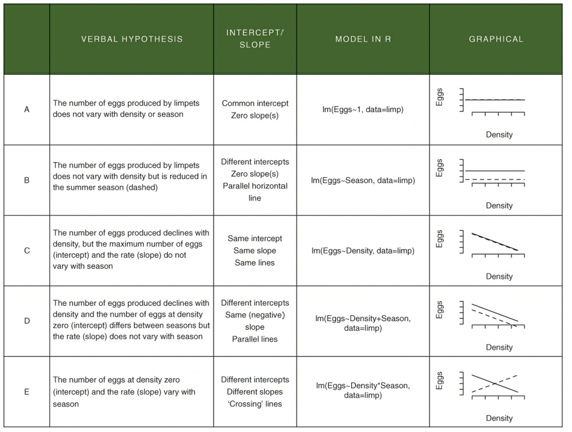

# Advancing Statistics in R

```{r install-06, echo=T, message=FALSE, warning=FALSE, results='hide',cache=TRUE}
install.packages("ggplot2",  repos = "https://cran.us.r-project.org")
install.packages("dplyr",  repos = "https://cran.us.r-project.org")
install.packages("ggfortify",  repos = "https://cran.us.r-project.org")
```

```{r load-libs-06, echo=T, message=FALSE, warning=FALSE, results='hide'}
library(ggplot2)
library(dplyr)
library(ggfortify)
```

## The two-way ANOVA 

- the two-way ANOVA differs from the one-way version in that it involves two categorical/explanatory variables 
- the response variable in the two-way ANOVA may vary with both explanatory variables 
  - if the way it varies depends on the other explanatory variable, then this phenomenon is known as a statistical interaction 

Read in data: 
```{r read-data-06}
urlfile06a="https://raw.githubusercontent.com/apicellap/data/main/growth.csv"
growth.moo<-read.csv(url(urlfile06a))
glimpse(growth.moo)
```

### Cow Growth data
- this dataset deals with cows on different diets
  - cows were fed one of three diets: 
    - wheat, oats, or barley 
  - each diet was then enhanced with one of four supplements:
    - supergrain, control, supersupp, agrimore 
  - each diet combination had 3 biological replicates (cows)
  
Coerce two of the variables into factors: 
```{r factor-coercion-06}
growth.moo$supplement <-as.factor(growth.moo$supplement) 
growth.moo$diet <-as.factor(growth.moo$diet) 
```

```{r levels-diet-06}
levels(growth.moo$diet)
```

```{r levels-supp-06}
levels(growth.moo$supplement)
```

- in both of the previous code chunks the output is in alphabetical order
- R always declares the first level alphabetically the reference level 
- in the case of the supplement variable, control must be made the reference level
  - this can be accomplished using the `relevel()` function: 
  
```{r relevel-cows-06}
growth.moo <- mutate(growth.moo,
                     supplement = relevel(supplement, ref = "control"))
levels(growth.moo$supplement)
```

Create summary dataframe: 
```{r summary-cows-06}
sumMoo <- growth.moo  %>% 
  group_by(diet,supplement) %>% 
  summarise(meanGrow = mean(gain))
sumMoo

```

```{r cows-data-viz-06}
ggplot(sumMoo, aes(x=supplement, y=meanGrow,
                   colour = diet,   #adds color by group
                   group = diet)) + #
  geom_point() +
  geom_line() + #connects the dots in each dataset 
  theme_bw()
```

- the different supplements might have growth stimulating effects 
- the barley and/or oats diets might be better in stimulating growth relative to the wheat diet
- since the lines are about parallel with each other, then we can probably rule out interaction effects. This means the effect of supplement probably does not depend on the effect of diet 
- but there might be an additive effect 

- null hypothesis: the effect of supplement type does not depend on diet

Create a model to evaluate the null hypothesis: 
```{r model-cows-06}
model_cow <- lm(gain ~ diet * supplement, 
                data=growth.moo)
model_cow
```

- function asks if the growth depends on diet, supplement, or an interaction between diet:supplement 

Check assumptions: 
```{r cows-assumptions-06, warning=FALSE}
autoplot(model_cow, smooth.colour = NA)
```

- plot output: they look okay, but not ideal
  - top left - no pattern that would suggest model is inappropriate 
  - top right - less than ideal because the positive and negative residuals are smaller than     expected but the general linear model will be able to deal with these deviations from normality 
  - bottom left - looks fine, virtually no pattern 
  - bottom right - no serious outliers, looks fine 
  
Create ANOVA table: 
```{r cows-anova-table}
anova(model_cow)
```

- the diet:supplement row shows a small F value and a p value of 0.91 (way bigger than 0.05)
- there is no statistically significant effect contributed by the two variables together 
- revisit the importance of a big F value 

Create summary table: 
```{r summarystats-cows}
summary(model_cow)
```

- output: 
  - the intercept is the reference point for the table. it's the barley-control because barley is alphabetically first 
  - and we already set the reference to be the control 
  - the Estimate column is the difference between the reference level and the level in each row  

Generate new summary table: 
```{r summary-cows-w-se}
sumMoo <- growth.moo  %>% 
  group_by(diet,supplement) %>% 
  summarise(meanGrow = mean(gain),
            seGrow = 
              sd(gain)/
              sqrt(
                n()))  #n() counts the number of observations in each group 
                      #side note: n() will count observations even if they have missing values
  sumMoo        
```

Replot the data with standard error bars: 
```{r cows-data-viz2}
ggplot(sumMoo, aes(x=supplement, y=meanGrow,
                   colour = diet,   #adds color by group
                   group = diet)) + #
  geom_point() +
  geom_line() + #connects the dots in each dataset 
  geom_errorbar(aes(ymin = meanGrow - seGrow,
                    ymax = meanGrow + seGrow), width = 0.1) + 
  theme_bw()
```

## Analysis of Covariance (ANCOVA)

- this linear model is unique in that it combines a categorical explanatory variable with a continuous explanatory variable 

Read in data: 
```{r read-data-limpets}
urlfile06b="https://raw.githubusercontent.com/apicellap/data/main/limpet.csv"
limp<-read.csv(url(urlfile06b))
glimpse(limp)
```

- this dataset involves egg production by limpets 
  - there are 4 density conditions in two production seasons 
- the response (y) variable is egg production 
- the independent (x) variables include: 
  - density (continuous)
  - season (categorical)
- this is a study of density dependent reproduction 
- Does density dependence of egg production differ between the spring and summer seasons?

Coerce variable into a factor: 
```{r limp-coercion}
limp$SEASON <-as.factor(limp$SEASON) 
is.factor(limp$SEASON) #allows you to check that the coercion worked 
```

Start by plotting the data: 
```{r limp-plot}
ggplot(limp, aes(x = DENSITY, y = EGGS, colour=SEASON)) + #colour - gives color to the two levels of the categorical variable, Grazing
  geom_point() +
  scale_color_manual(values = c(spring = "green", summer = "red")) + 
  xlab("Limpet Density") + 
  ylab("Eggs produced") + 
  theme_bw()  
```

- Output observations: 
  - As limpet density increases, there seems to be a decrease in egg production
  - There appears to be a seasonal difference in egg production in which yields are better in spring than in summer 
    - mathematically, the intercept (the value of egg production) at a density of 0 is higher in spring 
- Thinking about this plot in terms of regression: 
  - y is egg production 
  - x is density 
  - b is where the line crosses the y axis (egg production when density = 0)
  - m is the slope of the egg production density relationship - 
  - Change in egg production per unit change in density - strength of density dependence 

Verbal, mathematical, R, and graphical interpretations of various hypotheses related to the ANCOVA that translate into specific linear models: 
```{r insert-table-06, echo=FALSE, out.width="90%"}

```

- In the above table, neither A or B reflect the data in the limpet density scatterplot 
- E also does not do the data justice because the slopes are approximately parallel 
- C and D are possible 
  - D is the best explanation of the data 
- The difference between E and D is the presence (E) or absence (D) of an interaction term that specifies that the slopes are different 
  - An interaction would look like - "The effect on density on egg production depends on the season" 
    - The effect of density on egg production = slope value 
    - Depends on the season = values may differ depending on the season 
    
### Constructing the ANCOVA 

```{r limp-model}
limp.mod <- lm(EGGS ~ DENSITY * SEASON, #expression says we want model to analyze a (main) effect of DENSITY,
               #a (main) effect of SEASON, and the potential for the effect of DENSITY
               #to depend on SEASON (interaction )
               
               data = limp)

limp.mod
```

- Null hypothesis: the interaction term is not significant 
  - That is to say - there are no differences in the slopes for each season 
    - There is no extra variation explained by fitting different slopes 

Fetch the coefficients (intercepts and slope estimates), the residuals, the fitted values, etc.: 
```{r fetch-coeffs-08}
names(limp.mod)
```

Check assumptions: 
```{r limp-assumptions, warning=FALSE}
autoplot(limp.mod,smooth.colour = NA)

```

 - The assumptions are met according to the above figures 
 
 Generate an anova table: 
```{r limp-anovatab}
anova(limp.mod)
```
 
- output:
  - big F values/small p values - DENSITY and SEASON - effects are significant/unlikely to be the result of chance
    - effects of DENSITY and SEASON are additive 
  - small F value/big p value - DENSITY:SEASON - no interaction 
  
Generate a summary table: 
```{r limp-sumtab}
summary(limp.mod)
```

- Upper portion of the table:  
  - R lists things alphanumerically (spring would be listed before summer)
  - SEASONsummer is the difference between the spring and summer y intercepts 
  - My rough calculations estimated this to be -0.756, which is very close to their -0.81 
  - DENSITY:SEASONsummer is the difference between slopes for spring and summer 
    - In other words, it is the change in the rate of density dependence that arises from shifting from spring to summer 
  - In the summmer, the density dependence was only 0.003 units (egg prod/density) lower than in spring which was found not to be statistically significant 
  - Summer reduces egg production compared with spring, on average, by 0.812 eggs - significant 

- Bottom of coefficients table: 
  - Adjusted R-squared (0.6705) - means that the model we have fitted explains 67% of the variation in egg production 
  - Low p value - the model has a signficant fit to the data p < 0.001
  - Large F statistic 
  
### Putting the lines onto the figure 

- We need to predict some y values using a sensible range of x values 
  - We can use the model eggs(spring) = 2.66 - 0.033 x DENSITY to accomplish this
  
```{r limp-coefs}
coef(limp.mod)

```

Build a factorial representation of variables and output a grid of numbers: 
```{r expand-example}
expand.grid(FIRST = c("A","B"), SECOND = c(1,2))  

```

Predict y values at all provided x values: 
```{r predicted-Xs-06}
predict(limp.mod) 
```

- 24 values returned because, 2 seasons x 4 density treatments x 3 replicates = 24 

To generate a new set of x values we could use: 
```{r new-Xs-06}
new.x <- expand.grid(DENSITY =              
                       seq(from =8, to=45, #the new x values will be between 8 and 45 
                           length.out = 10), #generates 10 new x values for each parameter 
                     SEASON = levels(limp$SEASON)) #sets the parameter as season. 
head(new.x)
```

We can now embed these 'new.x' x values into the `predict()` function: 
```{r predicted-Ys-06}
new.y <- predict(limp.mod, 
                 newdata = new.x, #instructs R to use the new x values 
                 interval = 'confidence') #for confidence interval around each y value (fit) 
head(new.y)

```

Now for some housekeeping: 
```{r housekeeping-06}
addThese <- data.frame(new.x, new.y) #combines the two dfs into a single one 
addThese <- rename(addThese, EGGS = fit) #changes the column name "fit" to EGGS 
head(addThese)
```

Plot the data: 
```{r final-limp-plot}
ggplot(limp, aes(x=DENSITY, y = EGGS, colour = SEASON)) + 
  geom_point(size = 2.5) + #specifies the size of the point
  
  geom_smooth( #adds the regression line and the CI around the fitted line;
    #assumes that x and y are the same as already specified in ggplot
    data = addThese, 
    aes(ymin = lwr, ymax = upr, #confidence interval 
        fill = SEASON), #different fill depending on the SEASON variable 
    stat = 'identity') + #tells geom_smooth to use what is in the dataframe and not calculate anything else
  
  scale_colour_manual(values = c(spring="green", summer = "red")) + #color for the regression line
  scale_fill_manual(values = c(spring="green", summer = "red")) + #color for the confidence interval area 
  theme_bw()
```


