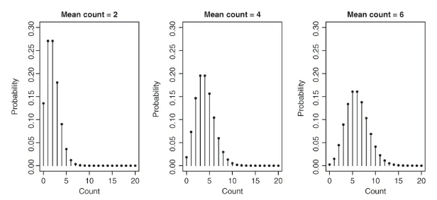
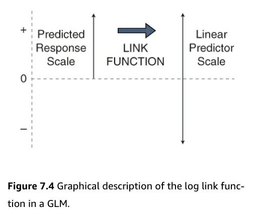

# Getting Started with Generalized Linear Models

- Response variables in linear model-based analyses have several common features including that: 
  - We assume they are continuous variables that can take negative and positive values and can be fractions 
  - We also assume that these data are bounded (but in practice, sometimes they are not)
  - The models assume normally distributed residuals 
  - The model also assumes a constant mean-variance relationship 
- Often there are response variables in which the normality assumption is violated 
- Examples of data that violate assumptions: 
  - Integer valued data that is bounded and cannot be fractioned or negative (i.e. the number of people)
  - Binary data (i.e. presence/absence data)
- Historically for these types of data, transformations are employed such as log10 transformations for counts or arcsin(sqrt()) transformations for proportion data 
- This is where the generalized linear model (GLM) may be utilized 

### Counts and Proportions and the GLM 

- Count data: 
  - Are bounded by 0 and infinity 
  - Violate the normality assumption 
  - Do not have a constant mean-variance relationship
- Example: 
  - How the number of offspring a female may produce over her lifetime relates to body size 
    - How a rate of occurence of events (births) depends on other variables (body size)
- Proportion data - data are often binary 
  - flowering data 
  - animal death 
  - species sex ratios 
- These occurences are often related to 1+ explanatory variables 
- These data are binomial 

### Key terms of GLM models 

- Family 
  - The probability distribution that is assumed to describe the response variable 
  - In other words, it's a mathematical statement of how likely events are 
  - Poisson and binomial distributions are examples of families 
- Linear predictor 
  - This is an equation that describes how the different predictor variables (explanatory variables) affect the expected value of the response variable 
- Link function 
  - Describes the mathematical relationship between the expected value of the response variable and the linear predictor, *linking*, the two aspects of the GLM
  
- `glm()` will be used to create generalized linear models 


## Counts and rates - Poisson GLMs 

### Counting Sheep - the data and question 

- In this dataset, the response variable is a count variable 
- We aim to understand how the rate of occurence of events depends on 1 or more explanatory variables 
- Dataset backstory: 
  - It's about a specific population of sheep 
  - These sheep are on an island off the west coast of Scotland 
  - They are unmanaged/feral population of Soay sheep 
  - There has been a lot of scientific interest on this population to study how the population is evolving 
  - Several studies have been done on female (ewe) fitness 
    - One way to measure fitness is to count the total number of offspring born to a female during her life - 'lifetime reproductive success' 
      - response variable = counts of offspring, which are poorly approximated by a normal distribution 
- question: Does lifetime reproductive success increase with ewe bodymass? 
  - Do larger ewes produce more offspring? 
  - If so, then is there a heritable difference in body mass - is there selection pressure on this trait? 
  
```{r install-07, echo=T, message=FALSE, warning=FALSE, results='hide',cache=TRUE}
install.packages("ggplot2",  repos = "https://cran.us.r-project.org")
install.packages("dplyr",  repos = "https://cran.us.r-project.org")
install.packages("ggfortify",  repos = "https://cran.us.r-project.org")
```

```{r load-libs-07, echo=T, message=FALSE, warning=FALSE, results='hide'}
library(ggplot2)
library(dplyr)
library(ggfortify)
```

```{r load-data-07}
urlfile07a="https://raw.githubusercontent.com/apicellap/data/main/SoaySheepFitness.csv"
soay<-read.csv(url(urlfile07a))
str(soay)
```

Visualize the data: 
```{r viz-data-07}
ggplot(soay, aes(x = body.size, y = fitness)) + 
  geom_point() + 
  geom_smooth(method = "lm", se = FALSE) + #applies linear regression (blue) line 
  geom_smooth(span = 1,                    #determines how wiggly the curve is 
              colour = "red", se = FALSE) + #applies a non-linear and more  flexible statistical model  
  xlab("Body mass (kg)") + ylab("Lifetime fitness")
```

- Based on the loose fitting models, there is a strong positive relationship between fitness and body size in which larger ewes have more offspring over time
  - Larger ewes have more resources to allocate to reproduction 
- The red line clearly captures the relationship more effectively than the blue one
- The upward trending of the red line is an issue of non-linearity 
- There are also subtler issues with the data
- To really understand these problems, the authors want to analyze the data the incorrect way and then right the wrongs with the correct analysis after 

## Doing it wrong 

Create an inappropriate model using the linear model approach: 
```{r wrong-model, warning=FALSE}
soay.mod <- lm(fitness ~ body.size, data = soay)
autoplot(soay.mod, smooth.colour = NA) 
```

- Almost all of our assumptions are violated 

### Doing it wrong: diagnosing the problems 

- **Residuals vs fitted values (upper left)**: 
  - Suggests that the systematic part of the model is inappropriate because there is a pattern of the datapoints 
    - In fact, the U-shape of the data indicate that the straight-line model fails to account for the curvature in the relationship between our two variables 
  - Fitness is underestimated at small body sizes 
  - Fitness is overestimated at larger body sizes 
- **Normal Q-Q plot (upper right)**:
  - Most of the points should be on the dashed diagnonal line and they are not 
    - Many of the points in positive territory are above the line
    - Many of the points in negative territory are below the line 
  - We see this pattern because the distribution of residuals is not symmetrical 
    - In this case, it is skewed to the right
    
Visualize rightward skew through a histogram: 
```{r skew-histogram}
ggplot(soay, aes(x=body.size))+ geom_histogram(bins=20)
```

- **Scale location plot (bottom left)**: 
  - There is a clear pattern that shows a positive relationship between the absolute size of the residuals and the fitted values 
    - This reflects the way the fitness values are scattered around the red line: there is more vertical spread in the data at larger fitness values 
    - Based on this, we can say that there is a positive mean-variance relationship in the data 
    - In other words, large predicted fitness values are associated with more variation in the residuals
    - This is typical of count data 
- **Residuals-leverage plot (bottom right)**:
  - This plot is not too bad 
  - There are no extreme standardized residual values 
    - No obvious outliers 
  - None of the observations are having an outsized effect on the model 

**Overall, the normal linear regression is not doing a good job of describing the data** 

### The Poisson distribution - a solution

- The normality assumption built into the linear regression model is not appropriate for these data - Properties of a normal distribution: 
  - Concerns continuous variables (can assume fractional values)
    - Count data are discete (i.e. a ewe can produce 0,1,2, etc. lambs)
  - Normal distribution allows for negative values 
    - Count data must be positive (i.e. ewe cannot have -2 offspring)
  - Symmetry. 
    - Count data often are asymmetrical
- Poisson distribution is a good starting point for the analysis of certain forms of count data 

A visual for understanding the Poisson distribution: 
```{r insert-figure-07, echo=FALSE, out.width="90%"}

```
    

- The above figure displays three Poisson distributions and each has a different mean 
- The x-axis has a range of different possible values and the y axis has the probability of each value 
- Reasons why the poisson distribution is a good model for the Soay data: 
  - Only discete counts are possible 
  - Data are bounded at 0 
  - Very large counts are possible and in the scope of the model; however, their occurence is unlikely 
  - Variance of the distribution increases as the mean of distribution is increased 
    - This corresponds to the widening of the base the distribution with a higher mean 
- The poisson distribution is best equipped for *unbounded* count data 
  - What unbounded here refers to is just that there is no uppper limit to the values that the count variable may take 
  - There are obvious biological constraints, but we don't actually know the limit 

## Doing it right - the Poisson GLM 

### Anatomy of a GLM 

- GLM is comprised of three key terms: family, linear predictor, the link function 

- **family**: 
  - This is the error aspect of the GLM 
  - Determines what kind of distribution is used to describe the response variable. Options: 
    - Poisson distribution 
    - Binomial distribution 
    - Gamma distribution (positive valued, continuous variables)
    - Other exotic versions 
  - Each option is appropriate for specific types of data 
- **linear predictor**: 
  - Every time a model is built with the `lm()` function, some data and an R formula must be supplied to define the model 
  - The R formula defines the linear predictor
  - Soay example: 
    - inappropriate regression with model: lm(fitness ~ body.size, data = soay)
    - This tells R to build a model for the predicted fitness given an intercept and body size slope term: Predicted fitness = Intercept + Slope x Body size 
    - The linear predictor is 'Intercept + Slope x Body size' 
      - so it's basically just the model 
    - Coefficients shown by `summary(soay.mod)` are just the intercepts and slopes of th linear predictor 
- **The link function**: 
  - A model that cannot make impossible predictions is preferred 
    - You can plug numbers into the formul that will produce illogical outputs such that: 
      - A negative number of offspring in this sheep example 
    - With the GLM, instead of trying to model the predicted values of the response variable directly, we model a mathematical transformation of the prediction 
      - The transformation is the link function 
  - Using a Poisson GLM to model the fitness vs body mass relationship, the model for the predicted fitness would look like this: 
    - Log[Predicted fitness] = Intercept + Slope x Body size 
      - This is a natural log in this case 
      - The link function in a standard Poisson GLM is always natural log 
  - Instead of the linear predictor describing fitness directly, it relates the natural logarithm of predicted fitness to body size 
    - This must be positive, but the log transformed value can take any value 
  - Solve for predicted fitness to get: 
  - Predicted fitness = e^{Intercept + Slope x Body size}
  
- A Poisson GLM for the Soays sheep implies an exponential relationship between fitness and body mass 
  - linear model does not mean a linear relationship 
- The link function allows for the estimation of the paramenteres of a linear predictor that is apporpriate for the data
  - This is accomplished by transforming the response 'scale' to the scale of the linear predictor, which in this case a natural log scale, which is defined by the link function
  - This is can be visualized in the following figure: 
  
```{r insert-figure2-07, echo=FALSE, out.width="90%"}

```

- Figure:   
  - Count data is bounded by 0 and positive infinity 
    - Predicted values must be greater than 0 to be valid for count data
  - But, to do effective statistics, we need to operate on a scale that is unbounded 
  - Using the link function accomplishes this 
  - It moves us from the positive numbers (predicted average counts) scale to the whole number line (the linear predictor) scale 
  
### Doing it right - actually fitting the model 

Build the GLM: 
```{r soay-GLM}
soay.glm <- glm(fitness ~ body.size, data = soay, 
                family = poisson(
                  link = log)) #this line is unnecessary because the log link function is the default for poisson glm 

```

### Doing it right - the diagnostics 

```{r glm-diagnostics-07,warning=FALSE}
autoplot(soay.glm, smooth.colour = NA) 

```

- Overall, the diagnostics look much better 
  - **Residuals vs fitted values (upper left)**: 
    - The systematic aspect of the model is fairly appropriate 
      - There is no clear pattern in the relationship apart from a very slight upward trend 
      - Not enough to be concerned with though 
  - **Normal Q-Q plot (upper right)**:
    - There is some departure from the dashed diagnonal line, but a perfect plot is not expected 
    - Confirms that the distributional assumptions are okay 
  - **Scale location plot (bottom left)**: 
    - There is a slight positve relationship between the size of the residuals and the fitted values, but not too much of a concern 
  - **Residuals-leverage plot (bottom right)**:
    - Shows no evidence that there are outliers or points having an outsized effect on the model 

- Keep in mind that when R does diagnostics for a GLM, it uses standardized deviance residuals 
  - This is a transformed version of raw residuals that make transformed residuals normally distributed if the GLM family that is being used is appropriate 
  - This means that if the chosen family is appropriate for the data, then the diagnostics should show that the residuals are normally distributed 
  - And the diagnostic plots can be evaluated in the same way as for a linear model because the tests are doing all the same jobs 

### Doing it right - `anova()` and `summary()` 

- Thus far it looks that fitnesss is positively related to body mass 
- The next step is to test hypotheses 

Create Analysis of **Deviance** table for the GLM: 
```{r soay-glm-deviance}
anova(soay.glm)
```

- "Deviance" here is closely related to the idea of likelihood, which is a general tool for doing statistics 
  - Short explanation of likelihood: provides us with a measure of how probable the data would be if they had really been produced by that model 
    - Using likelihood, you can find a set of best-fitting model coefficients by picking values that maximize likelihood 
    - Also, sum of squares and mean squares allow for the comparison of different models when normality is assumed 
    - Likelihood (and deviance) do the same thing for GLMs 
- no p values in this table 
  - Total deviance for NULL (fitness) is 85.081 and body.size explains 37.041 units of the deviance   - So bodysize accounts for almost half of the deviance. This is very large.  
  - There is no p value because R wants the type of test to calculate it to be specified 
- p values in the GLM involve a $\chi$$^{2}$ distribution rather than an F-distribution (this does not mean that a $\chi$$^{2}$ test is to be performed)

Specifiy the type of test: 
```{r soay-glm-deviance-chi^2}
anova(soay.glm, test = "Chisq")
```

- The test statistic has a value of 37.041 
  - The corresponding p value is very small 
  - This is unsurprising given the strong relationship visualized in the scatterplot 
  - This is a likelihood ratio test 
- This means that fitness does vary positively with body size and there is selection pressure on higher body mass 


Find out more about the model: 
```{r glm-summary}
summary(soay.glm)
```

- Table output: 
  - First chunk is self explanatory 
  - Second chunk - "useless" summary of specially scaled (deviance) residuals 
  - Third chunk - coefficients
    - model is a line so there are only two coefficients - the intercept and a slope 
    - Each coefficient has a standard error to tell us how precise it is and a z-value to help us determine if the estimate is significantly different from 0 and the associated p value 
  - Fourth chunk - dispersion parameter - *more on this later* 
  - Fifth chunk - summaries of the null deviance, residual deviance, and their dfs
    - null deviance - measure of all the 'variation' in the data 
    - residual deviance - measure of what is left over after fitting the model 
      - The bigger the difference in these two values, the more variation is explained by the model
  - AIC = Akaike information criterion (not analyzed in this text)
  - Number of Fisher Scoring iterations - not important 
- Upon looking at the original scatterplot that helped visualize the data and this summary table, it might be confusing to see that the intercept has a negative value 
  - But remember that the link function is being used to predict the natural logarithm of lifetime fitness, not actual fitness 
- We will revisit the overdispersion concept later in the chapter 

### Making a beautiful graph 

- Need to generate a set of new x values 

Generate new x values: 
```{r new-Xs}
min.size = min(soay$body.size)
max.size = max(soay$body.size)

new.x = expand.grid(body.size = 
                      seq(min.size, max.size, #the new x values will be between these two parameters 
                          length = 1000)) #R generates 1000 values between 
```


- Now the `predict()` function can be used:
  - `predict()` is given three arguments: the GLM model, a value for newdata, and a request for standard errors 
  - Side note: `predict()` for glm does not have a confidence interval argument, so they have to be manually rendered into the dataframe 


```{r new-Ys}
new.y <- predict(soay.glm, 
                 newdata = new.x, #instructs R to use the new x values 
                 se.fit = TRUE) #provides standard errors.predict() for glm() doesn't have an interval = confidence argument
new.y = data.frame(new.y) #converts new.y into a dataframe 
head(new.y)
```

Combine new x values with new y values: 
```{r housekeeping-xy-vals}
addThese = data.frame(new.x, new.y)
names(addThese)[names(addThese) == 'fit'] <- 'fitness' #this will match the original data 

head(addThese)
```


Calculate and include the confidence intervals in the dataframe: 
```{r housekeeping-CIs}
addThese = mutate(addThese, 
                  lwr = fitness -1.96 * se.fit, #this and the line below add the lower and upper bounds of the 95% CI 
                  upr = fitness +1.96 * se.fit)
head(addThese)
```

Visualize the data with our new model + predicted values: 
```{r erroneous-plot}
ggplot(soay, aes(x = body.size, y = fitness)) + 
  geom_point(size = 3, alpha = 0.5) + 
  geom_smooth(data = addThese, 
              aes(ymin = lwr, ymax = upr), stat = 'identity') + 
  theme_bw()
```

it didn't work: 

- What happened is that the default scale for `predict()` is just the scale of the link function
- The link function uses a logarithmic scale 
  - This means that the predictions are the log of the expected fitness, but we want to plot the actual fitness values 
- To fix this, the inverse log must be applied to any y-axis variables in addThese 
  - To inverse log, we just have to exponentiate them 

Recreate the y values: 
```{r recreate-vals}
min.size = min(soay$body.size)
max.size = max(soay$body.size)

new.x = expand.grid(body.size = seq(min.size, max.size, length = 1000)) 

new.y <- predict(soay.glm, 
                 newdata = new.x, 
                 se.fit = TRUE)  
new.y = data.frame(new.y) 
addThese = data.frame(new.x, new.y)
head(addThese)
```
Exponentiate the y values: 
```{r exponentiate-Ys}
addThese = mutate(addThese, 
                  fitness = exp(fit),
                  lwr = exp(fit - 1.96 *se.fit), 
                  upr = exp(fit - 1.96*se.fit)) 
head(addThese)
```
Revisulize the data: 
```{r final-plot}
ggplot(soay, aes(x = body.size, y = fitness)) + 
  geom_point(size = 3, alpha = 0.5) + 
  geom_smooth(data = addThese, 
              aes(ymin = lwr, ymax = upr), stat = 'identity') + 
  theme_bw()

```

## When a Poisson GLM isn't good for counts

- The previous data set was the best case scenario for a GLM and the simplest use case 
- Now we will work with more realistic data 

### Overdispersion
- Overdispersion means 'extra variation' 
- GLMs make strong assumptions about the nature of variability in the data 
  - We have seen how the variance increases with the mean 
  - For a Poisson distribution, the variance is equal to the mean 
    - This assumption can only be true if you can account for every source of variation in the data (big assumption esp in biology)
  - But Biology creates variation that cannot be measured or accounted for 
  - This is the source of the overdisperson problem 
    - From non-independence in the data 
      - Non-independence refers to the idea that some elements in the data are more similiar to one another than they are to other things
      - i.e. cannabis plants in experiment are more similiar to each other than a random plant 
- overdispersion sounds like BS but it can really mess up statistical output if it is ignored (i.e. p-values) and end up with false positives
- What to do about it? 
  - First: detect it. 
  
```{r od-detect}
summary(soay.glm)
```

- If a GLM is working appropriately and there is no overdispersion, then residual deviance (48.040) and its degrees of freedom (48) should be equal 
- Perform $\frac{residual~deviance}{residual~degrees~of~freedom}$ 
- Then the output is a 'dispersion index (DI)' which should be approximately 1 
  - If much bigger than 1, then the data are overdispersed  
    - As a rule of thumb, if $DI \ge 2$ 
  - If it is much less than 1, then the data are underdispersed (this is rare)
- Fortunately, the soay data have normal dispersion levels 
- If data are overdispersed, then you can model the data differently
- A simple fix is to change the family in `glm()` from family = poisson to family = quasipoisson
  - a quasi model works just like the glm but it also estimates the dispersion index in a much more clever way than we did
  - Once this index value is known, then R can adjust the p-values accordingly 
- Can also switch to a negative binomial family 
  - A negative binomial distribution is thought of as being more flexible than a Poisson distribution 
  - The variance increases with the mean, but in a less constrained way. The variance does not have to equal the mean 
  

```{r quasi-soay-mod}
soay.glm2 <- glm(fitness ~ body.size, data = soay, 
                family = quasipoisson(
                  link = log)) 
summary(soay.glm2)
```

- The only difference between this summary statistics table and the original one for the soay glm is the p-values. They are based on a method that accounts for over/underdispersion
- One more thing. Need to tell R to take into account the estimated dispersion by: 

```{r soay-glm-deviance-F, warning=FALSE}
anova(soay.glm, 
      test = "F") #instead of Chisq
```

#### Negative binomials 

- Use `glm.nb()` to build negative binomial models from the *MASS* package (base-R)
- There is little else new that I need to learn 
- The default link function is the natural log, but can check ?glm.nb for alternatives 
- Neither quasi or negative binomial models appropriately deal with overdispersion that is caused by non-independence 
  - This is the job of mixed models, which will not be discussed in this text 

### Zero inflation

- One specific source of overdispersion in Poisson-like count data is known as zero-inflation 
- This occurs when there are too many zeroes relative to the expected number for whichever distribution is being used 
  - If count is zero-inflated, you can often spot it with a chart of raw counts (i.e. spike at 0 on a bar chart - often results from zero-inflation)
- Biological counts are often zero-inflated 
  - Occurs when binary results combine with a Poisson process

### Transformations ain't all bad 

- Sometimes transformations are appropriate, sometimes not 
- When in doubt, build the model and test the diagnostics 
- If the diagnostics look okay, then it's probably fine to use the model 
- Advantages of using transformations: 
  - They work well when the data are far away from zero (no zeroes), but don't span orders of magnitiude 
  - Can analyze "split-plot" designs fairly easily 


